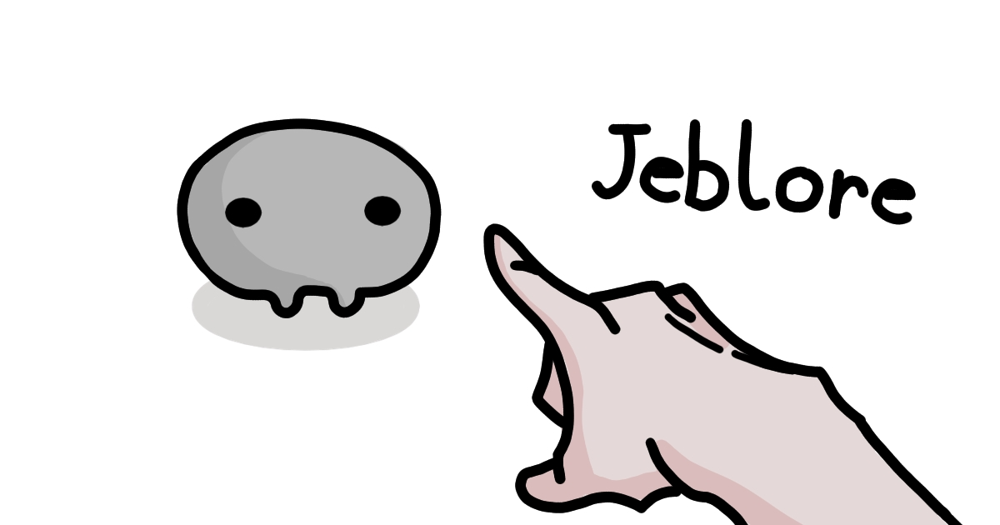

<!-- Improved compatibility of back to top link: See: https://github.com/othneildrew/Best-README-Template/pull/73 -->
<a id="readme-top"></a>
<!--
*** Thanks for checking out the Best-README-Template. If you have a suggestion
*** that would make this better, please fork the repo and create a pull request
*** or simply open an issue with the tag "enhancement".
*** Don't forget to give the project a star!
*** Thanks again! Now go create something AMAZING! :D
-->


<!-- PROJECT SHIELDS -->
<!--
*** I'm using markdown "reference style" links for readability.
*** Reference links are enclosed in brackets [ ] instead of parentheses ( ).
*** See the bottom of this document for the declaration of the reference variables
*** for contributors-url, forks-url, etc. This is an optional, concise syntax you may use.
*** https://www.markdownguide.org/basic-syntax/#reference-style-links
-->
[![Contributors][contributors-shield]][contributors-url]
[![Forks][forks-shield]][forks-url]
[![Stargazers][stars-shield]][stars-url]
[![Issues][issues-shield]][issues-url]
[![MIT][license-shield]][license-url]
[![LinkedIn][linkedin-shield]][linkedin-url]


<!-- PROJECT LOGO -->
<br />
<div align="center">
  <a href="https://github.com/juliankrzysiak/jeblore">
    
  </a>

<h3 align="center">jeblore</h3>

  <p align="center">
    A website for jeblore, a webcomic about living with Jeb and other creatures.
    <br />
    <a href="https://github.com/juliankrzysiak/jeblore"><strong>Explore the docs »</strong></a>
    <br />
    <br />
    <a href="https://jeblore.com">View Demo</a>
    ·
    <a href="https://github.com/juliankrzysiak/jeblore/issues/new?labels=bug&template=bug-report---.md">Report Bug</a>
    ·
    <a href="https://github.com/juliankrzysiak/jeblore/issues/new?labels=enhancement&template=feature-request---.md">Request Feature</a>
  </p>
</div>


<!-- TABLE OF CONTENTS -->
<details>
  <summary>Table of Contents</summary>
  <ol>
    <li>
      <a href="#about-the-project">About The Project</a>
      <ul>
        <li><a href="#built-with">Built With</a></li>
        <li><a href="#features">Features</a></li>
        <li><a href="#how-its-made">How It's Made</a></li>
        <li><a href="#learning-outcomes">Learning Outcomes</a></li>
      </ul>
    </li>
    <li>
      <a href="#getting-started">Getting Started</a>
      <ul>
        <li><a href="#prerequisites">Prerequisites</a></li>
        <li><a href="#installation">Installation</a></li>
      </ul>
    </li>
    <li><a href="#usage">Usage</a></li>
<!--<li><a href="#roadmap">Roadmap</a></li> -->
    <li><a href="#contributing">Contributing</a></li>
    <li><a href="#license">License</a></li>
    <li><a href="#contact">Contact</a></li>
    <li><a href="#acknowledgments">Acknowledgments</a></li>
  </ol>
</details>


<!-- ABOUT THE PROJECT -->
## About The Project

Desktop Light             |  Mobile Dark
-------------------------|-------------------------
  |  

<p align="right">(<a href="#readme-top">back to top</a>)</p>

### Built With

<!-- 
* [![Next][Next.js]][Next-url]
* [![React][React.js]][React-url]
* [![Svelte][Svelte.dev]][Svelte-url]
-->

* [![Astro][Astro-shield]][Astro-url]
* [![TypeScript][TypeScript-shield]][TypeScript-url]
* [![Keystatic][Keystatic-shield]][Keystatic-url]

 ### Features
* Performant static site for hosting webcomics
* Git-based CMS to easily change data
* Simple and accessible design
* Cool theme picker

### How It's Made
  I made this website using a static site generator, Astro, because it is perfect for content-focused websites like this for increases performance and pleasant DX. The only JS used is for the theme picker.

  I designed the webite to be simple, emulating the simple mind of Jeb, our eponymous main character.

  And the simplicity of use and focus on accessibility also leads to better UX.

  Kepping in this theme, I wanted the website to be easily updated, so I opted for a git-based CMS, which would just store the images in the repo. All the images are optimized during the build process.

### Learning Outcomes

| The Good                               | The Bad                                              | The Ugly |
|----------------------------------------|------------------------------------------------------|----------|
| Performance from SSG   | Too much time spent on what is the best CMS   |           |
| Back to Vanilla CSS |     Did not have a good time with Decap CMS                     |          |
|             Accessibility            |   URL issues in prod                                                     |          |
|            Theme Picker          |                                                      |          |
  

<p align="right">(<a href="#readme-top">back to top</a>)</p>


<!-- GETTING STARTED -->
## Getting Started

To get a local copy up and running follow the steps.

### Prerequisites

This is an example of how to list things you need to use the software and how to install them.
* pnpm
  ```sh
  npm install -g pnpm
  ```

### Installation

1. Clone the repo
   ```sh
   git clone https://github.com/juliankrzysiak/jeblore.git
   ```
2. Go to project directory
   ```sh
   cd jeblore
   ```
3. Install dependencies
   ```sh
   pnpm install
   ```
4. Start the server
   ```sh
   pnpm start
   ```

<p align="right">(<a href="#readme-top">back to top</a>)</p>


<!-- USAGE EXAMPLES -->
## Usage

You can add new comics or other data by accessing the CMS in dev mode. Start up dev mode then append /keystatic to the home url, eg. `http://127.0.0.1:4321/`.

The default storage mode is local, but this can be [changed to github](https://keystatic.com/docs/github-mode) to allow for others with write permission to the repo to change data. 

```js
export default config({
	storage: {
		kind: 'github',
	}
})
```

For an easier option for non-tecnical clients, one can change the [storage mode to cloud](https://keystatic.com/docs/cloud).

You can easily change the structure of the data by going to `keystatic.config.ts` and modifying what you would like. 

I am hosting this on Cloudflare Pages, so you can get rid of the adapter in `astro.config.mjs` if you hosted elsewhere.

<p align="right">(<a href="#readme-top">back to top</a>)</p>


<!-- ROADMAP 
## Roadmap

- [ ] Feature 1
- [ ] Feature 2
- [ ] Feature 3
    - [ ] Nested Feature

See the [open issues](https://github.com/juliankrzysiak/jeblore/issues) for a full list of proposed features (and known issues).

<p align="right">(<a href="#readme-top">back to top</a>)</p>
-->

<!-- CONTRIBUTING -->
## Contributing

Contributions are what make the open source community such an amazing place to learn, inspire, and create. Any contributions you make are **greatly appreciated**.

If you have a suggestion that would make this better, please fork the repo and create a pull request. You can also simply open an issue with the tag "enhancement".
Don't forget to give the project a star! Thanks again!

1. Fork the Project
2. Create your Feature Branch (`git checkout -b feature/AmazingFeature`)
3. Commit your Changes (`git commit -m 'Add some AmazingFeature'`)
4. Push to the Branch (`git push origin feature/AmazingFeature`)
5. Open a Pull Request

<p align="right">(<a href="#readme-top">back to top</a>)</p>

### Top contributors:

<a href="https://github.com/juliankrzysiak/jeblore/graphs/contributors">
  
</a>

<!-- LICENSE -->
## License

Distributed under the MIT license EXCEPT for any images / assets. See `LICENSE.txt` for more information.

<p align="right">(<a href="#readme-top">back to top</a>)</p>


<!-- CONTACT -->
## Contact

Julian Krzysiak - jkrzysiak13@gmail.com

Project Link: [https://github.com/juliankrzysiak/jeblore](https://github.com/juliankrzysiak/jeblore)

<p align="right">(<a href="#readme-top">back to top</a>)</p>


<!-- ACKNOWLEDGMENTS -->
## Acknowledgments

* [Favicon Generator](https://favicon.io/)
* [Making the theme picker accessible](https://fossheim.io/writing/posts/accessible-theme-picker-html-css-js/)

<p align="right">(<a href="#readme-top">back to top</a>)</p>


<!-- MARKDOWN LINKS & IMAGES -->
<!-- https://www.markdownguide.org/basic-syntax/#reference-style-links -->
[contributors-shield]: https://img.shields.io/github/contributors/juliankrzysiak/jeblore.svg?style=for-the-badge
[contributors-url]: https://github.com/juliankrzysiak/jeblore/graphs/contributors
[forks-shield]: https://img.shields.io/github/forks/juliankrzysiak/jeblore.svg?style=for-the-badge
[forks-url]: https://github.com/juliankrzysiak/jeblore/network/members
[stars-shield]: https://img.shields.io/github/stars/juliankrzysiak/jeblore.svg?style=for-the-badge
[stars-url]: https://github.com/juliankrzysiak/jeblore/stargazers
[issues-shield]: https://img.shields.io/github/issues/juliankrzysiak/jeblore.svg?style=for-the-badge
[issues-url]: https://github.com/juliankrzysiak/jeblore/issues
[license-shield]: https://img.shields.io/github/license/juliankrzysiak/jeblore.svg?style=for-the-badge
[license-url]: https://github.com/juliankrzysiak/jeblore/LICENSE.txt
[linkedin-shield]: https://img.shields.io/badge/-LinkedIn-black.svg?style=for-the-badge&logo=linkedin&colorB=555
[linkedin-url]: https://linkedin.com/in/juliankrzysiak
[product-screenshot]: public/jb-og.png
[Next.js]: https://img.shields.io/badge/next.js-000000?style=for-the-badge&logo=nextdotjs&logoColor=white
[Next-url]: https://nextjs.org/
[React.js]: https://img.shields.io/badge/React-20232A?style=for-the-badge&logo=react&logoColor=61DAFB
[React-url]: https://reactjs.org/
[Svelte.dev]: https://img.shields.io/badge/Svelte-4A4A55?style=for-the-badge&logo=svelte&logoColor=FF3E00
[Svelte-url]: https://svelte.dev/
[Astro-shield]: https://img.shields.io/badge/Astro-000000?style=for-the-badge&logo=astro&logoColor=BC52EE
[Astro-url]: https://astro.build/
[TypeScript-shield]: https://img.shields.io/badge/TypeScript-3178c6?style=for-the-badge&logo=typescript&logoColor=ffffff
[TypeScript-url]: https://www.typescriptlang.org/
[Keystatic-shield]: https://img.shields.io/badge/Keystatic-ffffff?style=for-the-badge&logo=keystone&logoColor=000000
[Keystatic-url]: https://keystatic.com/
